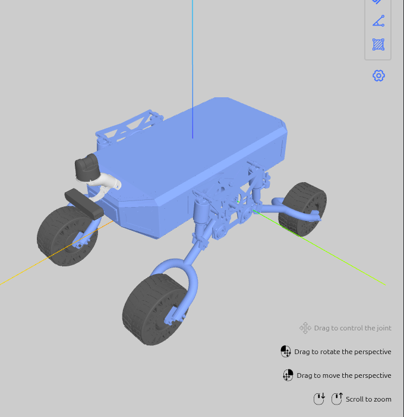

# Guide: Converting SolidWorks Assembly to URDF

This guide outlines the step-by-step process of converting a SolidWorks assembly into a URDF (Unified Robot Description Format) package for use in ROS 2.

**Reference tutorial**: [SolidWorks to URDF Export for ROS2 — YouTube](https://www.youtube.com/watch?v=JdZJP3tGcA4)

---

## Quick Overview of the steps

https://github.com/user-attachments/assets/78b0515b-8171-4838-8d3e-cb39331e3cd0

*Jaska V2 robot urdf preparation and conversion in Solidworks*



*Jaska V2 robot loaded in the URDF Visualizer after export and mesh path correction.*

---

## 1. Prerequisites

- **SolidWorks** 2025 or newer.
- **SW2URDF Plugin**: Download the `.exe` installer from the [ROS Wiki sw_urdf_exporter page](https://wiki.ros.org/sw_urdf_exporter) and install it. After install, the option appears under **Tools → Export as URDF**.
- **ROS 2** workspace (Humble / Iron / Jazzy) to build and visualise the result.

---

## 2. Assembly Preparation in SolidWorks

These steps must be done **before** running the exporter, and in this order. The exporter reads them directly.

### 2.1 Reference Points
For the chassis and every wheel or other static/moving link, create a **Reference Point** at the joint origin:

1. Go to **Insert → Reference Geometry → Point**.
2. Place the point at the centre of rotation or attachment location for the link.
3. Do this for `base_link`, all wheels, and any other links being exported.
4. Name each point clearly, e.g. `front_left_wheel_point`.

### 2.2 Reference Axes
For the chassis and every wheel or other static/moving link, create a **Reference Axis** through the joint rotation centre:

1. Go to **Insert → Reference Geometry → Axis**.
2. Select two planes or a cylindrical face to define the axis direction.
3. The exporter uses this to set the URDF `<axis xyz>` value.
4. Name each axis clearly, e.g. `front_left_wheel_axis`.

### 2.3 Coordinate Systems
For the chassis and every wheel or other static/moving link, create a **Coordinate System** at the joint pivot:

1. Go to **Insert → Reference Geometry → Coordinate System**.
2. Place the origin at the joint pivot point (use the reference point from §2.1).
3. Orient the axes — **the Z-axis must align with the joint rotation axis** (ROS convention).
4. Name each one clearly, e.g. `front_left_wheel_coord`.

### 2.4 Assembly Mates & Zero Position
- Ensure all parts are mated correctly.
- Set your assembly to the desired **zero/home position** — the exporter captures this as the default pose.
- Suppress any mates that are only for assembly convenience and would conflict with joint definitions.

---

## 3. Export Process

### Step 1 — Open the Exporter
1. In SolidWorks go to **Tools → Export as URDF**.
2. The URDF Exporter panel opens on the left side of the screen.

### Step 2 — Define the Link Tree
1. **Base Link**: Click the base component (e.g. chassis / `base_link`). This becomes the root of the tree.
2. **Add Child Links**: Right-click a link → **Add Child Link**.
   - Name it (lowercase + underscores only, e.g. `front_left_wheel`).
   - Select the SolidWorks bodies/sub-assemblies belonging to this link from the Feature Manager tree.
3. **Repeat** for every moving link.

### Step 3 — Configure Each Joint
For each child link in the tree, fill in:

| Field | What to select |
|---|---|
| **Joint Name** | e.g. `front_left_wheel_joint` |
| **Joint Type** | `Revolute`, `Continuous`, `Prismatic`, or `Fixed` |
| **Reference Coordinate System** | The coordinate system you created in §2.3 |
| **Reference Axis** | The reference axis you created in §2.2 |

### Step 4 — Preview & Export
1. Click **Preview and Export**.
2. In the pop-up window, set per-joint:
   - **Limits**: Lower / upper bounds (radians for revolute, metres for prismatic).
   - **Effort** and **Velocity**: Maximum values used by the simulator.
3. Verify the **Inertial** tab — mass and moments of inertia are auto-calculated from SolidWorks material properties.
4. Click **Finish**, choose a destination folder. The exporter creates:

```
<robot_name>/
├── meshes/          ← .STL files for every link
├── urdf/
│   └── <robot_name>.urdf
├── launch/
│   └── display.launch.py
├── CMakeLists.txt
└── package.xml
```

---

## 4. Post-Export: Fix Mesh Paths

The exporter sets `package://` paths using the **assembly name** as the package name, which often contains spaces or uppercase letters that break ROS 2. Update all mesh paths using `sed`:

```bash
# Example: exported as "Metrojoe Rover Assembly" → rename to jaska_description
sed -i 's|package://Metrojoe Rover Assembly/meshes/|package://jaska_description/meshes/jaska_v2/|g' \
    urdf/<robot_name>.urdf
```

Then move the STL files to the correct location:
```bash
mv meshes/*.STL src/jaska_description/meshes/jaska_v2/
```

---

## 5. Organise Meshes into Subdirectories

To keep v1 and v2 meshes separate (and enable the `add_sensor_to_urdf.py` workflow):

```
meshes/
├── jaska_v1/        ← v1 STLs + sensor STLs used by v1
└── jaska_v2/
    ├── base_link.STL
    ├── front_left_wheel.STL
    ├── ...
    └── sensors/     ← sensor STLs to attach via script
        ├── lidar_and_camera_mount.stl
        ├── unitree_l2.stl
        └── zedx.stl
```

---

## 6. Build & Visualise

```bash
cd /workspaces/ros2_ws
colcon build --packages-select jaska_description
source install/setup.bash
```

**Option A — URDF Visualizer extension (VS Code)**
Open `urdf/jaska_v2.urdf` and click the preview icon. Requires `urdf-visualizer.packages` set in `.vscode/settings.json`:
```json
"urdf-visualizer.packages": {
    "jaska_description": "src/jaska_description"
}
```

**Option B — RViz2**
```bash
ros2 launch jaska_description display.launch.py
```

---

## 7. Add Sensors to the Base URDF

Use the interactive script to attach sensor meshes (lidar, camera, mount) and produce `jaska_v2.urdf`:

```bash
cd src/jaska_description
python3 scripts/add_sensor_to_urdf.py
```

The script walks you through selecting the base URDF, sensor meshes, parent link, placement (xyz/rpy), scale, and mass. See [scripts/add_sensor_to_urdf.py](../scripts/add_sensor_to_urdf.py).

---

## 8. Sensor Manual Adjustment and Configuration

After running the script in §7, sensors may not be in their exact final positions. Two types of follow-up work are typically needed:

### 8.1 Interactive Position Adjustment

Use the **URDF Visualizer** extension (`morningfrog.urdf-visualizer`) in VS Code to interactively tweak sensor poses:

1. Open the URDF file in VS Code and click the preview icon to open the visualizer.
2. Use the **adjust-preview** mode to move and rotate sensors in real time.
3. The extension reflects `xyz` and `rpy` changes live — iterate until placement looks correct.
4. Copy the final `xyz`/`rpy` values back into the `<origin>` tag of the relevant joint in the URDF file.

> Ensure `urdf-visualizer.packages` is set in `.vscode/settings.json` (see §6) so `package://` paths resolve correctly.

### 8.2 Detailed Sensor Configuration

Some sensors require additional URDF links and joints beyond a simple mesh attachment — for example, the **ZED X camera** needs optical frame child links with specific orientations defined by the sensor manufacturer.

These configurations should be copied from the sensor provider's official sample URDF/xacro files:

- **ZED X**: Copy the camera optical child links and joints from the [zed-ros2-wrapper](https://github.com/stereolabs/zed-ros2-wrapper) sample URDFs and paste them under the `zedx` link in your URDF.
- **Unitree L2 Lidar**: Copy the lidar frame definition from the [unitree_lidar_ros2](https://github.com/unitreerobotics/unitree_lidar_ros2) package.
- For any other sensor, locate the manufacturer's ROS 2 package and copy the relevant link/joint block into your URDF after the mesh link added by `add_sensor_to_urdf.py`.

---

## Tips & Common Pitfalls

| Issue | Fix |
|---|---|
| Mesh path has spaces or wrong package name | Use `sed` to bulk-replace (§4) |
| Robot appears sideways in RViz | SolidWorks Z-axis ≠ ROS Z-up — add `rpy` offset on the visual origin |
| Meshes too large in visualizer | STL exported in mm — set `scale="0.001 0.001 0.001"` on the mesh tag |
| `package://` not resolved by URDF Visualizer | Add `urdf-visualizer.packages` mapping to `.vscode/settings.json` (§6) |
| `robot name` contains spaces | Edit the `<robot name="...">` tag in the URDF to use underscores |
| `ros2 pkg list` doesn't show the package | Run `colcon build` then `source install/setup.bash` |
